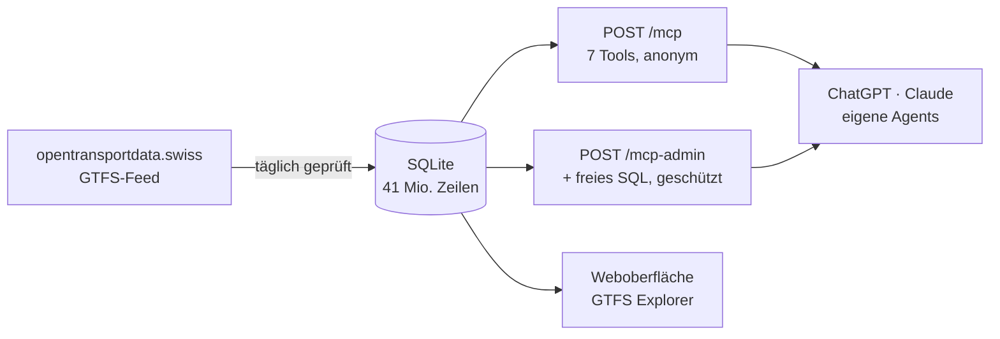

# ZVV GTFS MCP Server

Der gesamte Schweizer ÖV-Fahrplan als MCP-Server — abfragbar durch ChatGPT, Claude oder eigene Agents.

[](https://github.com/zvvch/zvv-mcp-gtfs/actions/workflows/ci.yml)
[](CHANGELOG.md)
[](LICENSE)
[](package.json)
[](https://modelcontextprotocol.io)
[](docs/ARCHITECTURE.md)

> [!NOTE]
> Dieses Projekt stellt die offiziellen Schweizer Fahrplandaten über das Model Context Protocol bereit. Ein Sprachmodell kann damit Haltestellen suchen, Abfahrten abrufen und direkte Verbindungen finden — in natürlicher Sprache, ohne die Datenstruktur zu kennen. Der Server läuft als Docker-Container auf beliebiger Hardware, baut seine Datenbank beim ersten Start selbst auf und hält den Fahrplan danach selbstständig aktuell. Zwei Endpunkte trennen offene Fahrplanabfragen von administrativen SQL-Analysen.



*Abbildung: Der Feed wird lokal in SQLite überführt und über zwei getrennt abgesicherte MCP-Endpunkte bereitgestellt.*

```
https://gtfs.zvv.dev/mcp          →  öffentlich, keine Anmeldung
https://gtfs.zvv.dev/mcp-admin    →  OAuth 2.1 oder Bearer-PIN
```

**Datenbestand** (Fahrplan 2026, Stand Juli): 41.1 Mio. Datensätze — 103'548 Haltestellen, 5'108 Linien, 474 Verkehrsunternehmen, 28.4 Mio. Haltezeiten. Quelle: [opentransportdata.swiss](https://opentransportdata.swiss). Den jeweils aktuellen Stand liefert `get_dataset_info` oder `GET /health`.

**Für wen ist das?** Wenn du den Fahrplan nur *abfragen* willst, brauchst du nichts zu installieren — trage `https://gtfs.zvv.dev/mcp` in deinem Client ein und lies bei [Als MCP-Server einbinden](#als-mcp-server-einbinden) weiter. Der [Schnellstart](#schnellstart) richtet sich an alle, die eine **eigene Instanz** betreiben wollen.

---

## Inhalt

- [Schnellstart](#schnellstart)
- [Als MCP-Server einbinden](#als-mcp-server-einbinden)
- [Die beiden Endpunkte](#die-beiden-endpunkte)
- [MCP-Tools](#mcp-tools)
- [Authentifizierung](#authentifizierung)
- [HTTP-Endpunkte](#http-endpunkte)
- [Weboberfläche](#weboberfläche)
- [Konfiguration](#konfiguration)
- [Fahrplan-Updates](#fahrplan-updates)
- [Entwicklung](#entwicklung)
- [Mitwirken und Support](#mitwirken-und-support)
- [Weiterführend](#weiterführend)

---

## Schnellstart

Voraussetzung: Docker mit Compose-Plugin. Sonst nichts.

```bash
git clone https://github.com/zvvch/zvv-mcp-gtfs.git
cd zvv-mcp-gtfs
cp .env.example .env
docker volume create zvv-gtfs-data
docker compose up -d
```

> [!IMPORTANT]
> Die vierte Zeile ist Pflicht. `docker-compose.yml` deklariert `zvv-gtfs-data` bewusst als **externes** Volume, damit ein `docker compose down -v` die Datenbank nicht mitreisst. Externe Volumes legt Compose nicht selbst an — fehlt es, bricht der Start sofort ab mit `external volume "zvv-gtfs-data" not found`. Der Befehl ist wiederholbar: existiert das Volume schon, passiert nichts.

Beim ersten Start baut der Container die Datenbank selbst auf: GTFS-ZIP laden, entpacken (~2.9 GB), rund 41 Mio. Zeilen nach SQLite importieren (~5.3 GB). Das dauert **10 bis 15 Minuten** und passiert genau einmal — danach liegen die Daten im Volume `zvv-gtfs-data` und überleben Updates und Neustarts. Rohdaten und Datenbank zusammen belegen rund **8.2 GB**.

Fortschritt mitlesen:

```bash
docker compose logs -f gtfs
```

Danach erreichbar unter `http://localhost:3000` (Web-UI), `POST /mcp` (MCP) und `GET /health`.

> **Zum Image:** Solange das GHCR-Paket privat ist, schlägt der Pull ohne Anmeldung fehl. Entweder einmalig `docker login ghcr.io`, oder das Paket unter *GitHub → Packages → Package settings → Change visibility* öffentlich schalten. `docker compose build` baut es alternativ lokal — dafür braucht es keine Registry.

---

## Als MCP-Server einbinden

### ChatGPT (Developer Mode)

Neue App anlegen mit der URL `https://gtfs.zvv.dev/mcp` und **No Authentication**. Die sieben Fahrplan-Tools sind ohne Anmeldung nutzbar.

Für die freie SQL-Abfrage stattdessen `https://gtfs.zvv.dev/mcp-admin` mit **OAuth** eintragen — Discovery, Registrierung und PKCE laufen automatisch, es erscheint nur eine PIN-Abfrage.

### Claude Code

```bash
claude mcp add --transport http zvv-gtfs https://gtfs.zvv.dev/mcp
```

Für den geschützten Endpunkt mit PIN:

```bash
claude mcp add --transport http zvv-gtfs-admin https://gtfs.zvv.dev/mcp-admin --header "Authorization: Bearer DEIN_PIN"
```

Prüfen mit `claude mcp list` — der Server sollte als `✔ Connected` erscheinen. Mit `-s user` gilt er projektübergreifend.

### Beliebige Clients

Regulärer MCP-Server über Streamable HTTP:

| | |
|---|---|
| Transport | Streamable HTTP (stateless) |
| Protokoll | 2025-06-18 |
| Accept | `application/json, text/event-stream` |

Schnelltest ohne jede Anmeldung:

```bash
curl -X POST https://gtfs.zvv.dev/mcp -H "Content-Type: application/json" -H "Accept: application/json, text/event-stream" -d '{"jsonrpc":"2.0","id":1,"method":"tools/list"}'
```

---

## Die beiden Endpunkte

| | `/mcp` | `/mcp-admin` |
|---|---|---|
| Anmeldung | keine | OAuth 2.1 + PKCE **oder** Bearer-PIN |
| Tools | 7 lesende Fachabfragen | dieselben 7 **plus** `query_gtfs` |
| Gedacht für | ChatGPT, Assistenten, öffentliche Nutzung | eigene Analysen, Datenexploration |

**Warum getrennt und nicht ein Endpunkt mit gemischter Authentifizierung?** Das MCP-SDK 1.29 kennt kein `securitySchemes` auf Tool-Ebene — `registerTool` verwirft unbekannte Schlüssel stillschweigend. Zwei Endpunkte sind der einzige verlässliche Weg. Details in [ARCHITECTURE.md](docs/ARCHITECTURE.md#warum-zwei-endpunkte).

**Warum ist der öffentliche Endpunkt offen?** Die Fahrplandaten sind offene Daten; schützenswert ist nicht ihre Vertraulichkeit, sondern die Rechenlast. Die steckt in der freien SQL-Abfrage — und die liegt hinter der Anmeldung.

---

## MCP-Tools

Alle Tools sind `readOnlyHint: true`. Die sieben Fachabfragen liefern zusätzlich `structuredContent` und haben ein `outputSchema`. `query_gtfs` gibt sein Ergebnis nur als JSON-Text in `content` zurück — die Spaltenform einer freien Abfrage steht nicht im Voraus fest.

### `search_stops(query, limit?)`

Haltestellen nach Namen suchen. Toleriert fehlende Umlaute (`zurich` findet `Zürich`) und die deutsche Umschreibung (`zuerich`), sucht wortweise (`zurich bellevue` findet `Zürich, Bellevue`) und fasst Haltekanten je Haltestelle zusammen.

```json
{ "query": "Zürich Bellevue", "limit": 5 }
```

### `get_stop_departures(stop, date?, time_from?, limit?)`

Nächste Abfahrten ab einer Haltestelle. Nimmt eine `stop_id` **oder** einen Haltestellennamen. Ohne Zeitangabe ab jetzt (Schweizer Zeit); mit `date` ab Tagesbeginn. Enthält Nachtkurse nach Mitternacht.

```json
{ "stop": "Zürich, Bellevue", "limit": 10 }
```

> [!IMPORTANT]
> `date` erwartet **`YYYYMMDD`** ohne Trennzeichen, `time_from` erwartet **`HH:MM:SS`**. Das ist die GTFS-Konvention, nicht ISO 8601 — `2026-07-23` oder `08:00` führen zu einem Fehler oder zu leeren Ergebnissen. Richtig: `{ "date": "20260723", "time_from": "08:00:00" }`.

Dieselben Formate gelten für `get_connections`.

### `get_connections(from, to, date?, time_from?, limit?)`

Direkte Verbindungen zwischen zwei Haltestellen, ohne Umsteigen. Beide Angaben als Name oder `stop_id`.

```json
{ "from": "Zürich HB", "to": "Bern", "limit": 5 }
```

> Umsteigeverbindungen berechnet dieses Tool nicht. Findet es nichts, sagt es das ausdrücklich im Feld `note`.

### `get_trip(trip_id)`

Alle Halte einer Fahrt in Reihenfolge, mit Ankunfts- und Abfahrtszeiten. Die `trip_id` stammt aus `get_stop_departures` oder `get_connections`.

### `get_routes(name?, agency_id?, route_type?, limit?)`

Linien, optional gefiltert. Für `route_type` sind sowohl die klassischen Werte als auch die erweiterten HVT-Werte des Schweizer Feeds erlaubt — klassische werden automatisch abgebildet:

| Klassisch | HVT-Bereich | Verkehrsmittel |
|-----------|-------------|----------------|
| 0 | 900–999 | Tram |
| 1 | 400–499 | Metro / Stadtbahn |
| 2 | 100–199 | Bahn (S-Bahn, IC, IR) |
| 3 | 700–799 | Bus |
| 4 | 1000–1099 | Schiff |
| 6 | 1300–1399 | Luftseilbahn |
| 7 | 1400–1499 | Standseilbahn |

### `get_agencies(limit?)`

Alle Verkehrsunternehmen mit der Anzahl ihrer Linien.

### `get_dataset_info()`

Welcher Fahrplan geladen ist, wann er geholt wurde, wie viele Datensätze je Tabelle vorliegen. Meldet ausdrücklich `realtime: false`.

### `query_gtfs(sql, limit?)` — nur auf `/mcp-admin`

Freie lesende SQL-Abfrage. Tabellen: `agency`, `stops`, `routes`, `trips`, `stop_times`, `calendar`, `calendar_dates`, `feed_info`, `transfers`, `frequencies`.

Die Abfrage muss mit `SELECT` oder `WITH` beginnen. Ein führender Kommentar (`-- Beschreibung`) ist erlaubt.

Abgewiesen werden Abfragen, die eines dieser Wörter als eigenständigen Bezeichner enthalten:

```
INSERT · UPDATE · DELETE · DROP · ALTER · CREATE
ATTACH · DETACH · PRAGMA · VACUUM · REINDEX · REPLACE
```

Die Prüfung greift nur auf **ganze Wörter ausserhalb von Zeichenketten**. Das heisst konkret:

| Abfrage | Ergebnis |
|---|---|
| `WHERE stop_name LIKE '%CREATE%'` | erlaubt — Literale werden ausgeblendet |
| `SELECT stop_id AS created` | erlaubt — `created` ist nicht `CREATE` |
| `SELECT REPLACE(name,'a','b')` | **abgewiesen** — `REPLACE` steht auf der Liste |

Die letzte Zeile ist der Preis einer einfachen Wortprüfung: die SQL-Funktion `REPLACE` ist harmlos, trägt aber denselben Namen wie das schreibende Statement. Nutze in dem Fall eine Umschreibung.

Ohne eigene `LIMIT`-Klausel wird eine Obergrenze angehängt. Der Wert aus `limit` wird auf 1 bis 1000 begrenzt und nie unverändert in die Abfrage übernommen.

### Keine Echtzeitdaten

`get_service_alerts` und `get_vehicle_positions` gibt es **nicht**. Der Feed von opentransportdata.swiss enthält ausschliesslich statisches GTFS, kein GTFS-Realtime. Leere Attrappen wären hier schlimmer als fehlende Tools — ein Modell würde aus „keine Störungen" schliessen, dass der Betrieb normal läuft.

---

## Authentifizierung

Drei Wege führen auf `/mcp-admin`. Der öffentliche `/mcp` braucht keinen davon.

### PIN als Bearer-Token

Am einfachsten für CLI-Clients:

```bash
curl -X POST https://gtfs.zvv.dev/mcp-admin -H "Authorization: Bearer DEIN_PIN" ...
```

### Session-Cookie (Web-UI)

Die Weboberfläche tauscht den PIN einmalig gegen ein HttpOnly-Cookie, 30 Tage gültig. Das Cookie ist zustandslos: der Ablaufzeitpunkt steckt darin und ist HMAC-signiert.

### OAuth 2.1 mit PKCE

Für Clients wie ChatGPT, die keinen festen Header hinterlegen können. Der Server ist zugleich Resource Server und Authorization Server; der PIN ist die Anmeldung.

| Endpunkt | Zweck |
|---|---|
| `/.well-known/oauth-protected-resource[/mcp-admin]` | Ressourcen-Metadaten (RFC 9728) |
| `/.well-known/oauth-authorization-server` | Server-Metadaten (RFC 8414) |
| `POST /register` | Dynamic Client Registration (RFC 7591) |
| `GET/POST /authorize` | Zustimmungsseite mit PIN-Eingabe |
| `POST /token` | `authorization_code` und `refresh_token` |

PKCE mit `S256` ist Pflicht. Access-Token gelten 1 Stunde, Refresh-Token 30 Tage. Alles ist HMAC-signiert und zustandslos — es gibt keinen Token-Speicher, ein Neustart verliert nichts.

### Brute-Force-Schutz

Alle Anmeldewege laufen in denselben Zähler: **10 Fehlversuche je IP** sperren diese für 15 Minuten, **30 Fehlversuche insgesamt** drosseln unabhängig von der Herkunft. Letzteres ist wichtig, weil sich eine reine IP-Sperre durch Adressrotation aushebeln liesse.

---

## HTTP-Endpunkte

| Endpunkt | Methode | Auth | Zweck |
|---|---|---|---|
| `/` | GET | — | Web-UI (GTFS Explorer) |
| `/health` | GET | — | Status, Datenstand, Tabellengrössen |
| `/mcp` | POST | — | Öffentlicher MCP-Endpunkt |
| `/mcp-admin` | POST | ja | Geschützter MCP-Endpunkt |
| `/api/suggest` | GET | ja | Live-Suche der Web-UI |
| `/api/query` | POST | ja | SQL-Abfrage der Web-UI |
| `/api/session` | GET | — | Anmeldestatus |
| `/api/login` · `/api/logout` | POST | — | PIN gegen Session-Cookie |
| `/register` · `/authorize` · `/token` | — | — | OAuth-Fluss |

---

## Weboberfläche

Unter `/` liegt der **GTFS Explorer** — eine Oberfläche zum Erkunden der Daten ohne Sprachmodell. Sie ist nützlich, um Haltestellen-IDs nachzuschlagen oder eine SQL-Abfrage auszuprobieren, bevor du sie an `query_gtfs` gibst.

| Reiter | Zweck |
|---|---|
| Haltestellen | Live-Suche beim Tippen, tolerant gegenüber Schreibweisen |
| Linien | Linien nach Nummer und Verkehrsmittel filtern |
| Abfahrten | Abfahrten ab einer Haltestelle zu Datum und Uhrzeit |
| Fahrt-Details | Alle Halte einer Fahrt |
| Unternehmen | Verkehrsunternehmen mit Anzahl Linien |
| SQL | Freie Abfrage mit Beispielen zum Anpassen |
| Status | Geladener Fahrplan und Tabellengrössen |
| Dokumentation | Kurzreferenz im Browser |

Die Oberfläche ist durch denselben PIN geschützt wie `/mcp-admin`. Nach der ersten Eingabe hält ein Sitzungscookie die Anmeldung dreissig Tage.

## Konfiguration

Im Docker-Betrieb wirken die folgenden Werte aus `.env`:

| Variable | Vorgabe | Bedeutung |
|---|---|---|
| `MCP_AUTH_TOKEN` | — | PIN für `/mcp-admin`, Web-UI und OAuth. Leer = **kein Schutz**. |
| `HOST_PORT` | `3000` | Host-Port, gebunden an `127.0.0.1` |
| `GTFS_AUTO_UPDATE` | `true` | Fahrplan selbstständig aktuell halten |
| `GTFS_UPDATE_INTERVAL_HOURS` | `24` | Abstand zwischen zwei Update-Prüfungen |
| `TUNNEL_ID` · `CF_CREDENTIALS_FILE` | — | Cloudflare Named Tunnel, siehe [OPERATIONS.md](docs/OPERATIONS.md#cloudflare-tunnel) |

Zwei weitere Werte liest der Server, aber `docker-compose.yml` reicht sie **nicht** durch. Sie wirken nur beim Betrieb ohne Container:

| Variable | Vorgabe | Bedeutung |
|---|---|---|
| `PORT` | `3000` | Port des Servers. Im Container über `HOST_PORT` steuern. |
| `GTFS_DB_PATH` | `zvv-data/gtfs.db` | Pfad, aus dem der Server **liest**. Aufbau und Update schreiben unabhängig davon nach `zvv-data/gtfs.db`. |

---

## Fahrplan-Updates

opentransportdata.swiss veröffentlicht mehrmals im Jahr einen neuen Fahrplan. Der Server hält sich selbst aktuell — ohne Cronjob, ohne Neustart.

Beim Start und danach täglich prüft er auf einen neueren Feed. Wenn ja, lädt und importiert er ihn **neben** dem laufenden Bestand und schwenkt erst um, wenn der neue Stand vollständig ist. Zwei Folgen, beide beabsichtigt:

- **Ein fehlgeschlagenes Update kostet nichts.** Bricht der Download ab, bleibt der bisherige Fahrplan in Betrieb. Der Server beantwortet durchgehend Anfragen.
- **Es braucht kurzzeitig doppelten Plattenplatz.** Der Dauerbedarf liegt bei rund 8.2 GB (Rohdaten und Datenbank), während eines Updates bei rund 16 GB.

Manuell auslösen:

```bash
docker compose exec gtfs node check-update.js --check   # nur prüfen
docker compose exec gtfs node check-update.js           # prüfen und aktualisieren
docker compose exec gtfs node check-update.js --force   # neu aufbauen
docker compose restart gtfs                             # danach zwingend
```

> [!WARNING]
> Der Neustart in der letzten Zeile ist Pflicht. `check-update.js` läuft als **eigener Prozess** und tauscht die Datenbankdateien aus, aber der laufende Server hält weiterhin sein Dateihandle auf den alten Stand. Ohne Neustart liefert er unverändert die alten Daten — ohne jeden Hinweis darauf. Der eingebaute Auto-Update-Pfad hat dieses Problem nicht: er schliesst das Handle vor dem Wechsel selbst.

---

## Entwicklung

```bash
npm install
npm run build     # GTFS laden + importieren (~10–15 Min)
npm start
npm test          # 73 Tests
```

Node.js ≥ 20 erforderlich (`better-sqlite3` kompiliert nativ).

```
zvv-mcp-gtfs/
├── server.js           # Express-App, Auth, OAuth, Endpunkte
├── mcp-tools.js        # MCP-Tool-Definitionen (öffentlich + admin)
├── oauth.js            # Signierte, zustandslose OAuth-Artefakte
├── download-gtfs.js    # Feed von opentransportdata.swiss holen
├── import-gtfs.js      # CSV → SQLite
├── check-update.js     # Atomarer Fahrplanwechsel
├── public/index.html   # Web-UI (GTFS Explorer)
├── docker/entrypoint.sh
└── test/smoke.test.js  # 73 Tests
```

---

## Mitwirken und Support

| Anliegen | Weg |
|---|---|
| Fehler melden | [Issue eröffnen](https://github.com/zvvch/zvv-mcp-gtfs/issues/new/choose) |
| Funktion vorschlagen | [Issue eröffnen](https://github.com/zvvch/zvv-mcp-gtfs/issues/new/choose) |
| Frage zur Nutzung | [Issue eröffnen](https://github.com/zvvch/zvv-mcp-gtfs/issues/new/choose) |
| Sicherheitsproblem | vertraulich nach [SECURITY.md](SECURITY.md), **nicht** als Issue |
| Änderung beitragen | [CONTRIBUTING.md](CONTRIBUTING.md) |

Fragen zu den Fahrplandaten selbst — fehlende Linien, falsche Zeiten — gehören zu [opentransportdata.swiss](https://opentransportdata.swiss). Dieses Projekt stellt die Daten nur bereit und verändert sie nicht.

## Weiterführend

- **[ARCHITECTURE.md](docs/ARCHITECTURE.md)** — Entwurfsentscheidungen und die Eigenheiten der Schweizer GTFS-Daten: SLOID-Umstellung, HVT-Linientypen, Nachtkurse, Verbindungssuche, Auth-Aufteilung.
- **[OPERATIONS.md](docs/OPERATIONS.md)** — Betrieb: Cloudflare-Tunnel, Reboot-Festigkeit, Fehlersuche.

---

## Lizenz und Quellen

Der Quellcode steht unter der [MIT-Lizenz](LICENSE).

Die **Fahrplandaten sind nicht Bestandteil dieses Repositoriums**. Sie stammen von [opentransportdata.swiss](https://opentransportdata.swiss), werden zur Laufzeit heruntergeladen und unterliegen deren eigenen Nutzungsbedingungen.

Der MCP-Teil beruht auf dem [offiziellen SDK](https://github.com/modelcontextprotocol/typescript-sdk).
