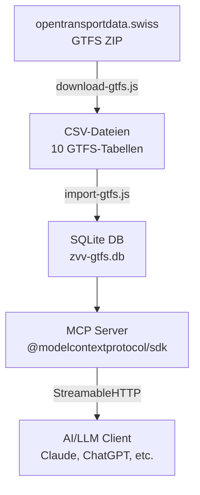

# ZVV GTFS MCP Server

MCP Server für Schweizer ÖV-Fahrplandaten (GTFS) -- abfragbar via AI/LLM-Systeme wie Claude, ChatGPT oder eigene Agents.

## Übersicht

Dieses Projekt stellt die offiziellen **GTFS-Fahrplandaten** der Schweiz (via [opentransportdata.swiss](https://data.opentransportdata.swiss)) über das **Model Context Protocol (MCP)** bereit. AI-Systeme können darüber strukturiert Haltestellen suchen, Abfahrten abfragen und Fahrpläne analysieren.

## Architektur



## Features

- 6 MCP-Tools für strukturierte GTFS-Abfragen
- SQLite-Datenbank mit allen 10 GTFS-Tabellen + Indexen
- Automatischer Download der neuesten Fahrplandaten
- StreamableHTTP-Transport (MCP-Standard)
- Vercel- und Docker-Deployment

## Quick Start

### Voraussetzungen

- Node.js >= 18

### Installation & Start

```bash
# Dependencies installieren
npm install

# GTFS-Daten herunterladen und in SQLite importieren
npm run build

# Server starten
npm start
```

Der Server ist dann erreichbar:
- **MCP Endpoint:** `POST http://localhost:3000/mcp`
- **Health Check:** `GET http://localhost:3000/health`

## MCP-Tools

| Tool | Beschreibung | Parameter |
|------|-------------|-----------|
| `search_stops` | Haltestellen suchen | `query`, `limit?` |
| `get_routes` | Linien abrufen | `agency_id?`, `route_type?`, `limit?` |
| `get_departures` | Abfahrten ab Haltestelle | `stop_id`, `date?`, `time_from?`, `limit?` |
| `get_trip_details` | Fahrt-Details mit allen Halten | `trip_id` |
| `get_agencies` | Alle Verkehrsunternehmen | -- |
| `query_gtfs` | Freie SQL-Abfrage (read-only) | `sql`, `limit?` |

### GTFS route_type Referenz

| Typ | Verkehrsmittel |
|-----|---------------|
| 0 | Tram / Strassenbahn |
| 1 | U-Bahn / Metro |
| 2 | Bahn (S-Bahn, IC, IR) |
| 3 | Bus |
| 4 | Fähre |
| 6 | Gondelbahn |
| 7 | Standseilbahn |

## MCP-Ressourcen

- `gtfs://status` -- Aktueller Daten-Status (Download-Datum, Version)
- `gtfs://schema` -- Datenbankschema aller Tabellen

## Projektstruktur

```
mcp-gtfs/
├── server.js           # MCP Server (Express + @modelcontextprotocol/sdk)
├── download-gtfs.js    # GTFS-Daten von opentransportdata.swiss herunterladen
├── import-gtfs.js      # GTFS CSV → SQLite Konverter
├── api/
│   └── mcp.js          # Vercel Serverless Function Entry Point
├── test/
│   ├── smoke.test.js   # Smoke Tests (30 Tests)
│   └── fixtures/       # Test-Daten (Mini-GTFS)
├── zvv-data/
│   └── gtfs/           # GTFS-Rohdaten (nicht versioniert)
├── package.json
├── vercel.json         # Vercel-Konfiguration
├── Dockerfile          # Docker-Image
└── docker-compose.yml  # Docker Compose
```

## Scripts

| Script | Beschreibung |
|--------|-------------|
| `npm run download` | GTFS-Daten herunterladen |
| `npm run import` | GTFS CSV → SQLite importieren |
| `npm run build` | Download + Import (komplett) |
| `npm start` | MCP Server starten |
| `npm test` | Smoke Tests ausführen (30 Tests) |

## Deployment

### Vercel

```bash
# Vercel CLI installieren
npm i -g vercel

# Deployen
vercel
```

Die `vercel.json` ist bereits konfiguriert. Im Build-Step werden die GTFS-Daten automatisch heruntergeladen und in SQLite importiert.

### Docker

```bash
# Container bauen und starten
docker-compose up --build

# Oder im Hintergrund
docker-compose up -d
```

## GTFS-Datenquelle

Die Fahrplandaten stammen von [opentransportdata.swiss](https://data.opentransportdata.swiss/de/dataset/timetable-2025-gtfs2020) und enthalten den gesamten Schweizer ÖV-Fahrplan.

**Enthaltene Tabellen:**
- `agency` -- Verkehrsunternehmen (SBB, ZVV, PostAuto, etc.)
- `stops` -- Haltestellen mit Koordinaten
- `routes` -- Linien (Tram, Bus, S-Bahn, etc.)
- `trips` -- Einzelne Fahrten
- `stop_times` -- Haltestellenzeiten pro Fahrt
- `calendar` -- Betriebstage
- `calendar_dates` -- Ausnahmen (Feiertage etc.)
- `feed_info` -- Metadaten zum Fahrplan
- `transfers` -- Umsteigebeziehungen
- `frequencies` -- Taktfahrten (start/end, Headway in Sekunden)

## Tests

```bash
npm test
```

30 Smoke Tests prüfen:
- CSV-Parser (Anführungszeichen, Escaping, leere Felder)
- SQLite-Import (alle 10 Tabellen, Zeilenanzahl, Metadaten)
- HTTP-Endpoints (Health, MCP, Server-Info)
- MCP-Tools (Suche, Filter, Joins)
- Security (SQL-Injection-Schutz)
- Download-Script (Modul-Exports, Konfiguration)

## Lizenz & Quellen

- GTFS-Daten: [opentransportdata.swiss -- Fahrplan 2025 (GTFS2020)](https://data.opentransportdata.swiss/de/dataset/timetable-2025-gtfs2020)
- MCP SDK: [@modelcontextprotocol/sdk](https://github.com/modelcontextprotocol/typescript-sdk)
