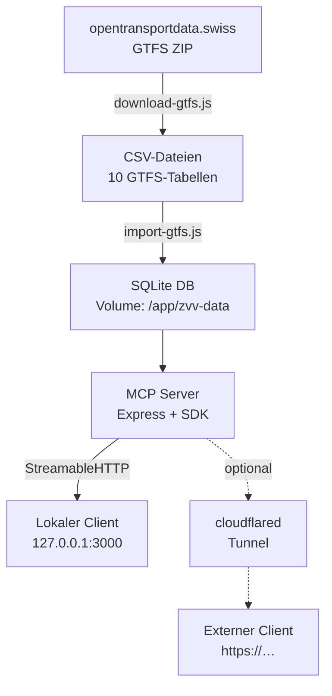

# ZVV GTFS MCP Server

MCP Server für Schweizer ÖV-Fahrplandaten (GTFS) -- abfragbar via AI/LLM-Systeme wie Claude, ChatGPT oder eigene Agents.

## Übersicht

Dieses Projekt stellt die offiziellen **GTFS-Fahrplandaten** der Schweiz (via [opentransportdata.swiss](https://data.opentransportdata.swiss)) über das **Model Context Protocol (MCP)** bereit. AI-Systeme können darüber strukturiert Haltestellen suchen, Abfahrten abfragen und Fahrpläne analysieren.

Der Server läuft als Container auf beliebiger Hardware. Die Fahrplandaten werden beim ersten Start selbst aufgebaut -- es muss nichts vorbereitet oder mitgeliefert werden.

## Architektur



## Quick Start

Voraussetzung: Docker mit Compose-Plugin. Sonst nichts.

```bash
git clone https://github.com/zvvch/zvv-mcp-gtfs.git
cd zvv-mcp-gtfs
cp .env.example .env

docker compose up -d
```

Beim allerersten Start baut der Container die Datenbank selbst auf: GTFS-ZIP laden, entpacken (~2 GB), rund 41 Mio. Zeilen nach SQLite importieren (~5.3 GB). Das dauert **etwa 10 bis 15 Minuten** und passiert genau einmal -- danach liegen die Daten im Volume `gtfs-data` und überleben Updates und Neustarts.

Fortschritt mitlesen:

```bash
docker compose logs -f gtfs
```

Danach erreichbar unter:

| | |
|---|---|
| Web-UI | `http://localhost:3000` |
| MCP Endpoint | `POST http://localhost:3000/mcp` |
| Health Check | `GET http://localhost:3000/health` |

Der Port ist bewusst nur auf `127.0.0.1` gebunden. Von aussen erreichbar wird der Dienst ausschliesslich über den Tunnel.

## Nach aussen teilen: Cloudflare-Bridge

Damit läuft der Server weiter lokal, ist aber unter einem festen Hostnamen erreichbar -- ohne Portfreigabe, ohne feste IP, auch hinter NAT.

1. **Tunnel anlegen:** [one.dash.cloudflare.com](https://one.dash.cloudflare.com/) → Networks → Tunnels → Create a tunnel → Cloudflared
2. **Public Hostname** im Tunnel konfigurieren: Service `HTTP` → URL `gtfs:3000`
   (`gtfs` ist der Compose-Servicename, cloudflared erreicht ihn über das interne Netz)
3. **Token und Zugriffstoken** in `.env` eintragen:

```bash
TUNNEL_TOKEN=eyJ...
MCP_AUTH_TOKEN=$(openssl rand -hex 32)
```

4. **Mit Bridge starten:**

```bash
docker compose --profile tunnel up -d
```

Ohne `--profile tunnel` läuft der Server rein lokal, der Tunnel-Container startet gar nicht.

## Zugriffsschutz

`MCP_AUTH_TOKEN` schützt `/mcp` und `/api/query` per `Authorization: Bearer <token>`. `/health` bleibt offen, damit Healthcheck und Cloudflare-Origin-Prüfung funktionieren.

**Sobald der Tunnel aktiv ist, ist das Token Pflicht.** Ohne Token wäre `/api/query` ein unauthentifizierter SQL-Endpunkt auf einer Tabelle mit 28 Mio. Zeilen -- ein Aggregat über einen Self-Join bindet die Maschine, und zwar von jedem beliebigen Absender aus. Der Server warnt beim Start, wenn kein Token gesetzt ist.

Clients senden das Token als Header:

```bash
curl -X POST https://dein-host/api/query \
  -H "Authorization: Bearer $MCP_AUTH_TOKEN" \
  -H "Content-Type: application/json" \
  -d '{"sql":"SELECT stop_name FROM stops LIMIT 5"}'
```

Die Web-UI fragt bei der ersten 401-Antwort danach und merkt es sich im Browser.

## MCP-Tools

| Tool | Beschreibung | Parameter |
|------|-------------|-----------|
| `search_stops` | Haltestellen suchen | `query`, `limit?` |
| `get_routes` | Linien abrufen | `agency_id?`, `route_type?`, `limit?` |
| `get_departures` | Abfahrten ab Haltestelle | `stop_id`, `date?`, `time_from?`, `limit?` |
| `get_trip_details` | Fahrt-Details mit allen Halten | `trip_id` |
| `get_agencies` | Alle Verkehrsunternehmen | -- |
| `query_gtfs` | Freie SQL-Abfrage (read-only) | `sql`, `limit?` |

### GTFS route_type Referenz

| Typ | Verkehrsmittel |
|-----|---------------|
| 0 | Tram / Strassenbahn |
| 1 | U-Bahn / Metro |
| 2 | Bahn (S-Bahn, IC, IR) |
| 3 | Bus |
| 4 | Fähre |
| 6 | Gondelbahn |
| 7 | Standseilbahn |

## MCP-Ressourcen

- `gtfs://status` -- Aktueller Daten-Status (Download-Datum, Version)
- `gtfs://schema` -- Datenbankschema aller Tabellen

## HTTP-Endpoints

| Endpoint | Methode | Auth | Beschreibung |
|----------|---------|------|--------------|
| `/` | GET | -- | Web-UI (GTFS Explorer) |
| `/health` | GET | -- | Serverstatus, Tabellenstatistiken |
| `/mcp` | POST | Token | MCP StreamableHTTP Endpoint |
| `/api/query` | POST | Token | SQL-Abfrage für die Web-UI |

## Konfiguration

| Variable | Default | Beschreibung |
|----------|---------|--------------|
| `MCP_AUTH_TOKEN` | -- | Bearer-Token für `/mcp` und `/api/query`. Leer = offen. |
| `TUNNEL_TOKEN` | -- | Cloudflare-Tunnel-Token. Nur für `--profile tunnel`. |
| `GTFS_AUTO_UPDATE` | `true` | Fahrplan selbstständig aktuell halten. `false` = nur melden. |
| `GTFS_UPDATE_INTERVAL_HOURS` | `24` | Abstand zwischen zwei Update-Prüfungen. |
| `PORT` | `3000` | Port des HTTP-Servers. |
| `GTFS_DB_PATH` | `zvv-data/gtfs.db` | Pfad zur SQLite-Datenbank. |

## Fahrplan-Updates

opentransportdata.swiss veröffentlicht mehrmals im Jahr einen neuen Fahrplan. Der Server hält sich selbst aktuell -- ohne Cronjob, ohne Neustart, ohne Handgriff von aussen.

**Wie es abläuft:** Beim Start und danach täglich prüft der Server, ob ein neuerer Feed vorliegt. Wenn ja, lädt und importiert er ihn **neben** dem laufenden Bestand in ein Staging-Verzeichnis. Erst wenn der neue Stand vollständig ist, wird umgeschwenkt -- zwei Renames, dann öffnet der Server die neue Datenbank.

Das hat zwei Konsequenzen, die beide beabsichtigt sind:

- **Ein fehlgeschlagenes Update kostet nichts.** Bricht der Download ab oder scheitert der Import, bleibt der bisherige Fahrplan unangetastet in Betrieb. Der Server beantwortet die ganze Zeit über Anfragen.
- **Es braucht kurzzeitig doppelten Plattenplatz** (~11 GB statt ~5.5 GB), solange Staging und Produktivstand nebeneinander liegen.

Der aktuelle Stand steht unter `/health` im Feld `update`.

Manuell auslösen:

```bash
docker compose exec gtfs node check-update.js --check   # nur prüfen
docker compose exec gtfs node check-update.js           # prüfen und aktualisieren
docker compose exec gtfs node check-update.js --force   # neu aufbauen, auch wenn aktuell
```

## Lokal ohne Docker (Entwicklung)

```bash
npm install
npm run build     # GTFS herunterladen + nach SQLite importieren (~10 Min)
npm start
```

Node.js >= 20 erforderlich (`better-sqlite3` 12 kompiliert nativ).

## Projektstruktur

```
zvv-mcp-gtfs/
├── server.js             # MCP Server (Express 5 + @modelcontextprotocol/sdk)
├── download-gtfs.js      # GTFS-Daten von opentransportdata.swiss herunterladen
├── import-gtfs.js        # GTFS CSV → SQLite Konverter
├── check-update.js       # Prüft auf neuen Fahrplan
├── docker/
│   └── entrypoint.sh     # Baut die DB beim ersten Start auf
├── public/
│   └── index.html        # Web-UI (GTFS Explorer)
├── test/
│   ├── smoke.test.js     # Smoke Tests (30 Tests)
│   └── fixtures/         # Test-Daten (Mini-GTFS)
├── zvv-data/             # Volume-Mountpoint (nicht versioniert)
├── Dockerfile
├── docker-compose.yml
└── .env.example
```

## Scripts

| Script | Beschreibung |
|--------|-------------|
| `npm run download` | GTFS-Daten herunterladen |
| `npm run import` | GTFS CSV → SQLite importieren |
| `npm run build` | Download + Import (komplett) |
| `npm start` | MCP Server starten |
| `npm run check-update` | Auf neuen Fahrplan prüfen |
| `npm test` | Smoke Tests ausführen (30 Tests) |

## GTFS-Datenquelle

Die Fahrplandaten stammen von [opentransportdata.swiss](https://data.opentransportdata.swiss/de/dataset/timetable-2026-gtfs2020) und enthalten den gesamten Schweizer ÖV-Fahrplan.

**Enthaltene Tabellen:**

| Tabelle | Inhalt |
|---------|--------|
| `agency` | Verkehrsunternehmen (SBB, VBZ, PostAuto, etc.) |
| `stops` | Haltestellen mit Koordinaten |
| `routes` | Linien (Tram, Bus, S-Bahn, etc.) |
| `trips` | Einzelne Fahrten |
| `stop_times` | Haltestellenzeiten pro Fahrt |
| `calendar` | Betriebstage |
| `calendar_dates` | Ausnahmen (Feiertage etc.) |
| `feed_info` | Metadaten zum Fahrplan |
| `transfers` | Umsteigebeziehungen |
| `frequencies` | Taktfahrten (Headway in Sekunden) |

## Tests

```bash
npm test
```

30 Smoke Tests prüfen:
- CSV-Parser (Anführungszeichen, Escaping, leere Felder)
- SQLite-Import (alle 10 Tabellen, Zeilenanzahl, Metadaten)
- HTTP-Endpoints (Health, MCP, Server-Info)
- MCP-Tools (Suche, Filter, Joins)
- Security (SQL-Injection-Schutz)
- Download-Script (Modul-Exports, Konfiguration)

## Lizenz & Quellen

- GTFS-Daten: [opentransportdata.swiss -- Fahrplan 2026 (GTFS2020)](https://data.opentransportdata.swiss/de/dataset/timetable-2026-gtfs2020)
- MCP SDK: [@modelcontextprotocol/sdk](https://github.com/modelcontextprotocol/typescript-sdk)
