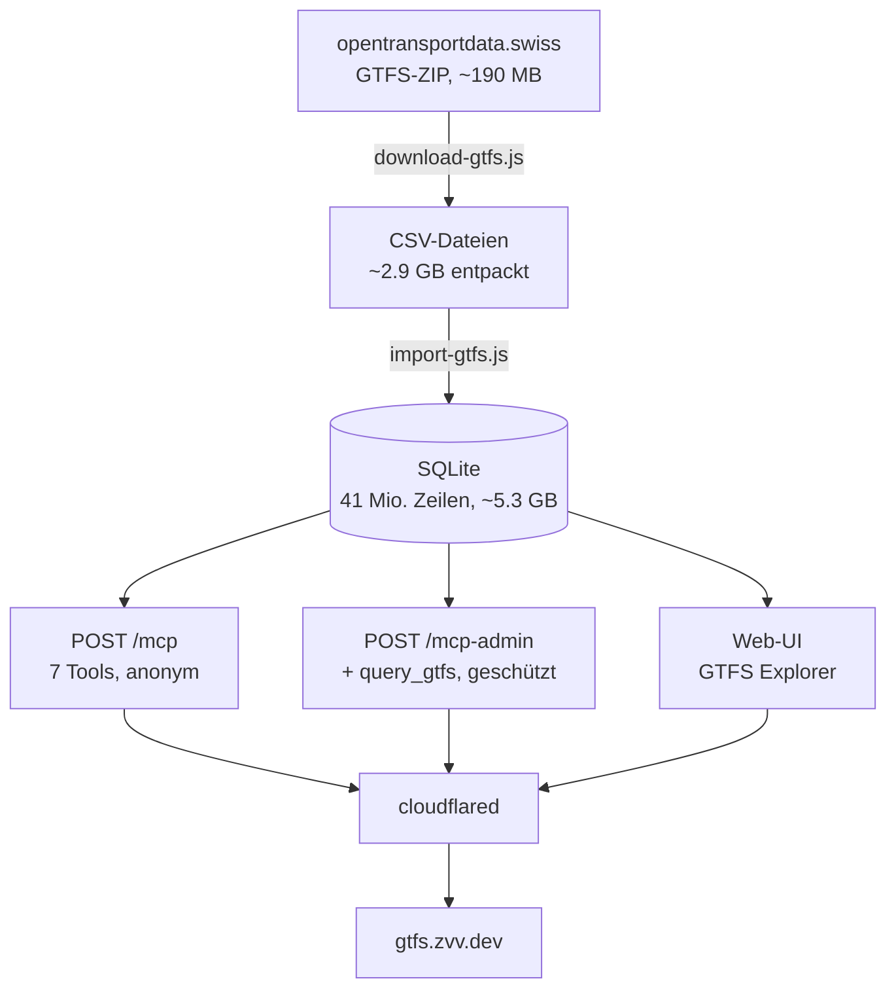
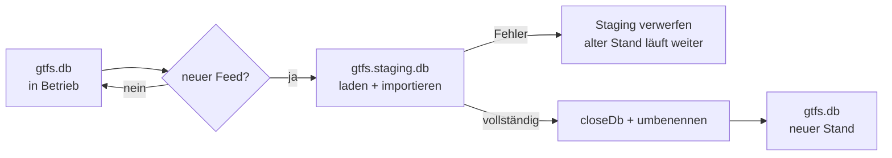

# Architektur und Entwurfsentscheidungen

Dieses Dokument hält fest, **warum** Dinge so gebaut sind. Vieles davon ist teuer erarbeitet — mehrere Punkte sind Fehler, die erst im Betrieb gegen echte Daten sichtbar wurden.

- [Datenfluss](#datenfluss)
- [Eigenheiten der Schweizer GTFS-Daten](#eigenheiten-der-schweizer-gtfs-daten)
- [Verbindungssuche](#verbindungssuche)
- [Warum zwei Endpunkte](#warum-zwei-endpunkte)
- [OAuth zustandslos](#oauth-zustandslos)
- [Atomarer Fahrplanwechsel](#atomarer-fahrplanwechsel)
- [Leistung](#leistung)

---

## Datenfluss



SQLite wurde gewählt, weil der Datensatz **statisch** ist: er ändert sich alle paar Wochen einmal, wird nie geschrieben und passt auf eine Platte. Die Datenbank wird readonly geöffnet — schon das schliesst eine ganze Fehlerklasse aus.

---

## Eigenheiten der Schweizer GTFS-Daten

Der Feed weicht an mehreren Stellen von dem ab, was GTFS-Tutorials nahelegen. Jede dieser Abweichungen hat hier einmal zu falschen oder leeren Ergebnissen geführt.

### SLOID statt DIDOK

Seit dem Fahrplan **2026-07** nutzen die Schweizer Haltestellen SLOID-Kennungen. Die bekannten DIDOK-Nummern kommen im Feed **überhaupt nicht mehr vor**:

```
früher:  8503000              (Zürich HB)
heute:   ch:1:sloid:3000
```

Wer die alte Nummer verwendet, bekam anfangs **stillschweigend null Abfahrten** — das schlimmste Fehlerbild, weil es wie ein leerer Fahrplan aussieht statt wie eine falsche ID.

Die Umrechnung: `85` entfernen, führende Nullen entfernen, `ch:1:sloid:` davorsetzen. Bestätigt an Zürich HB, Stadelhofen, Basel SBB, Bern, Luzern, Lausanne und St. Gallen — 7 von 7.

> **Sackgasse, die dokumentiert bleiben soll:** Ein erster Versuch stützte sich auf die Spalte `original_stop_id`, weil sie bei einer *ausländischen* Haltestelle die alte Nummer trug. Falsch: für die rund 96'000 Schweizer Stops dupliziert sie nur die SLOID. Der Fix war wirkungslos und fiel erst beim Test gegen die fertige Datenbank auf. Die Spalte hilft weiterhin bei den knapp 5'000 ausländischen Haltestellen, die nie eine SLOID hatten.

Wichtiger als die Umrechnung ist die zweite Lehre: **eine unbekannte ID muss als Fehler gemeldet werden, nicht als leeres Ergebnis.** Genau dieses stille Nichts hatte den Fehler wochenlang verdeckt.

### Erweiterte Linientypen (HVT)

Der Feed verwendet ausschliesslich die **erweiterten** `route_type`-Werte (100–1599), nie die klassischen 0–7:

```
route_type = 2   (Bahn, klassisch)  →  0 Treffer
route_type = 700 (Bus, HVT)         →  rund 3400 Linien
```

`get_routes` bildet klassische Werte deshalb auf die HVT-Bereiche ab. Vorher gab jede Anfrage nach „alle Bahnlinien" null Ergebnisse, obwohl Beschreibung und Dokumentation es versprachen.

### Nachtkurse jenseits von 24:00

GTFS kodiert Fahrten nach Mitternacht im Service-Tag **davor**, mit Zeiten über 24 Uhr:

```
00:30 heute  ≙  24:30:00 im Service-Tag von gestern
```

Der Feed enthält **rund 1.3 Mio. solcher Haltezeiten**; an einem Knoten wie Zürich HB sind es mehrere hundert je Betriebstag. `get_stop_departures` fragt deshalb zwei Betriebstage ab — den heutigen ab der Startzeit und den gestrigen ab Startzeit + 24 h — und rechnet die Zeiten des zweiten auf die Wanduhr zurück.

> Alle konkreten Zahlen in diesem Dokument sind Momentaufnahmen. Der Feed wird alle paar Wochen neu veröffentlicht, die Grössenordnungen bleiben aber stabil. Den aktuellen Stand liefert `get_dataset_info` oder `GET /health`.

### Zeitzone

Das Zieldatum wird in **Europe/Zurich** bestimmt, nicht in UTC. Sonst zeigte der Server zwischen Mitternacht und ~02:00 den Fahrplan des Vortags: das Datum kam aus UTC, die Uhrzeit aus Schweizer Zeit — zwei Betriebstage in einer Abfrage.

### Getrennte Stops für dasselbe Bauwerk

Bahn und Tram haben am selben Ort **verschiedene Haltestellen ohne gemeinsame Elternstation**:

```
Zürich Stadelhofen            ch:1:sloid:3003      (Bahnhof)
Zürich Stadelhofen, Bahnhof   ch:1:sloid:…         (Tramhaltestelle)
```

Eine Auflösung über `parent_station` allein findet von Bellevue aus **keine Tram** nach Stadelhofen. Die Ortsauflösung berücksichtigt deshalb den Namen und seine Untervarianten (`Name` plus `Name, …`).

### Namenssuche

Drei Dinge, die ein Sprachmodell sonst scheitern lassen:

| Eingabe | Problem | Lösung |
|---|---|---|
| `zurich` | Feed schreibt `Zürich` | normalisierte Spalte `stop_name_norm` ohne Diakritika |
| `zuerich` | deutsche Umschreibung | Rückfall `ue→u`, **nur bei null Treffern** |
| `zurich bellevue` | offiziell `Zürich, Bellevue` | wortweise Suche statt durchgehendem Substring |

Der Rückfall greift bewusst erst bei null Treffern — sonst würde `Neuenburg` zu `Nunburg` verstümmelt und fände nichts mehr.

Die Sortierung vergleicht **ohne Satzzeichen**, damit die Tramhaltestelle `Zürich, Bellevue` vor der Schiffstation `Zürich Bellevue (See)` liegt. Das muss **nach** dem SQL-`LIMIT` geschehen — mit `LIMIT 1` kam sonst die falsche durch.

---

## Verbindungssuche

`get_connections` findet direkte Verbindungen. Der Weg dahin war teuer:

| Ansatz | Laufzeit | Warum |
|---|---|---|
| Self-Join über `stop_times` | **20 s** | 28 Mio. Zeilen mit sich selbst verbunden |
| Zweistufig, Ziel per `stop_id IN (…)` | **19 s** | SQLite wählt den Stop-Index und scannt Millionen Zeilen |
| Zweistufig, Filter in JS | **0.9–3.2 s** | Stufe 2 filtert nur nach `trip_id` → Trip-Index |

Der entscheidende Punkt ist die dritte Zeile: Stufe 2 filtert **ausschliesslich nach `trip_id`**, damit der Abfrageplaner sicher den Trip-Index nimmt. Die Zielhalte werden anschliessend in JavaScript gefiltert. Ein zusätzliches `stop_id IN (…)` in der SQL kippt den Plan und kostet Faktor 20.

Ebenso wichtig ist die Deckelung der Ortsauflösung: `Bern` als Präfix trifft **1025 Haltekanten** von Bernex bis Berneck. Die Auflösung bestimmt deshalb zuerst den besten Namenstreffer und sammelt nur dessen Kanten ein.

**Bewusste Grenze:** Umsteigeverbindungen werden nicht berechnet. Das wäre eine echte Routensuche (RAPTOR o. Ä.) und ein anderes Projekt. Findet das Tool nichts, sagt es das im Feld `note`, statt schweigend leer zu antworten.

---

## Warum zwei Endpunkte

Der ursprüngliche Plan war ein Endpunkt mit gemischter Authentifizierung: harmlose Tools anonym, `query_gtfs` geschützt, deklariert über `securitySchemes` auf Tool-Ebene.

**Das SDK 1.29 kennt `securitySchemes` nicht.** `registerTool` destrukturiert exakt sechs Schlüssel:

```js
const { title, description, inputSchema, outputSchema, annotations, _meta } = config;
```

Jeder weitere Schlüssel wird **stillschweigend verworfen** — kein Fehler, keine Warnung, nichts auf der Leitung. Eine Deklaration wäre wirkungslos im Nichts verschwunden.

Deshalb zwei Endpunkte. Das ist zugleich die robustere Lösung: die Trennung liegt in der Middleware, nicht in Metadaten, die ein Client interpretieren muss.

`_meta` ist der offizielle Erweiterungskanal und wird unverändert ausgeliefert — die öffentlichen Tools tragen dort `securitySchemes: [{ type: "noauth" }]`. Ob ein Client das liest, ist offen; auf einem Endpunkt ohne jede Authentifizierung ist es ohnehin nur die Bestätigung des Offensichtlichen.

### `outputSchema` ist ein Vertrag mit Zähnen

Sobald ein Tool ein `outputSchema` deklariert, **muss** jede erfolgreiche Antwort ein dazu passendes `structuredContent` enthalten — sonst antwortet der Server mit `-32602` statt mit Daten. GTFS-Felder sind häufig leer, deshalb sind fast alle Felder in den Schemas `nullable`.

---

## OAuth zustandslos

Der Server ist zugleich Resource Server und Authorization Server. Für ein Einzelnutzer-Setup ist das angemessen und hält den Betrieb einfach: **alle Artefakte sind HMAC-signierte Nutzdaten**. Kein Token-Speicher, keine Datenbank, ein Neustart verliert nichts.

```
client_id       = c.<payload>.<hmac>     enthält die redirect_uris
authorization   = a.<payload>.<hmac>     60 Sekunden gültig
access_token    = t.<payload>.<hmac>     1 Stunde
refresh_token   = r.<payload>.<hmac>     30 Tage
session_cookie  = <exp>.<hmac>           30 Tage
```

### Typtrennung

Alle Artefakte werden mit **demselben** Secret signiert. Ohne Typkennzeichen im signierten Teil könnte ein Refresh-Token als Access-Token durchgehen — ein 30-Tage-Artefakt würde zum Vollzugriff. Das Kürzel (`c`, `a`, `t`, `r`) wandert deshalb **mit in die Signatur**; ein Test prüft genau diesen Fall.

### Einmalverwendung der Codes

Ein signierter Code ist für sich beliebig oft einlösbar. Ein gedeckeltes In-Memory-Set verhindert die zweite Einlösung. Weil es nach einem Neustart leer ist, leben Codes nur **60 Sekunden** — das Replay-Fenster ist damit winzig.

### Discovery muss zusammenpassen

RFC 9728 §3 schiebt den well-known-String **zwischen** Host und Pfad, §3.3 verlangt, dass das gelieferte `resource` exakt der Kennung entspricht, aus der die Abruf-URL gebildet wurde:

```
richtig:  /.well-known/oauth-protected-resource/mcp-admin  →  resource: …/mcp-admin
falsch:   /.well-known/oauth-protected-resource            →  resource: …/mcp-admin
```

Die falsche Variante war zunächst ausgeliefert. Ein streng prüfender Client **muss** sie zurückweisen — der Fluss wäre für ihn tot gewesen, und der eigene Test hatte es durchgewinkt, weil er nur prüfte, *dass* ein `resource_metadata`-Parameter da ist, nicht *wohin* er zeigt. Beide Pfade werden bedient; MCP 2025-11-25 nennt die Wurzel ausdrücklich als Rückfall.

### Audience-Prüfung

Ein Access-Token, das für eine andere Ressource ausgestellt wurde, wird mit `invalid_token` abgewiesen (RFC 8707). Fehlt die Angabe, gilt das Token — es kann ohnehin nur von diesem Server stammen, weil nur er das Signaturgeheimnis kennt.

---

## Atomarer Fahrplanwechsel

Ein Update darf den laufenden Betrieb nicht gefährden. Der neue Stand wird **neben** dem alten aufgebaut:



Vor dem Umbenennen wird `closeDb()` aufgerufen. Ohne das läse die offene readonly-Verbindung weiter den **alten Inode** — der Server würde stillschweigend veraltete Daten ausliefern.

**Selbstheilung:** Stirbt der Container genau zwischen den Umbenennungen, kann `gtfs.db` fehlen, während das Sentinel noch gesetzt ist. Der Entrypoint erkennt das: liegt die Sicherung `gtfs.db.old` vor, wird sie sofort zurückgestellt; sonst wird das Sentinel gelöscht und sauber neu aufgebaut.

---

## Leistung

Gemessen gegen den Produktivbestand (41 Mio. Zeilen):

| Vorgang | Laufzeit |
|---|---|
| `search_stops` | 0.1–0.2 s |
| `get_stop_departures` | 1.0–1.8 s |
| `get_connections`, innerstädtisch | 0.9 s |
| `get_connections`, Fernverkehr | 3.2 s |
| Live-Suche der Web-UI (`/api/suggest`) | 34 ms + ~50 ms Netz |
| `/health` | gecacht, O(1) |

Zwei Optimierungen tragen den grössten Teil:

**Normalisierte Suchspalte.** `stop_name_norm` wird beim Import materialisiert und indiziert. Ohne sie läuft pro Abfrage ein `REPLACE`-Stapel über 103'548 Zeilen — 56 ms statt 34 ms.

**Gecachte Tabellenzahlen.** `/health` rief früher bei **jedem** Aufruf `COUNT(*)` über alle Tabellen auf — auch beim Docker-Healthcheck alle 30 Sekunden und bei jedem unauthentifizierten Poller. Da die Datenbank readonly ist, ändern sich die Zahlen nur beim Update-Wechsel; der Cache wird genau dort verworfen.

**Bekannte Grenze:** Eine freie SQL-Abfrage mit teurem Aggregat (Self-Join ohne Grenze) kann den Node-Prozess blockieren. `better-sqlite3` arbeitet synchron und kann laufende Abfragen nicht abbrechen. Deshalb liegt `query_gtfs` hinter der Anmeldung — der Schutz ist die Zugangskontrolle, nicht ein Zeitlimit.
